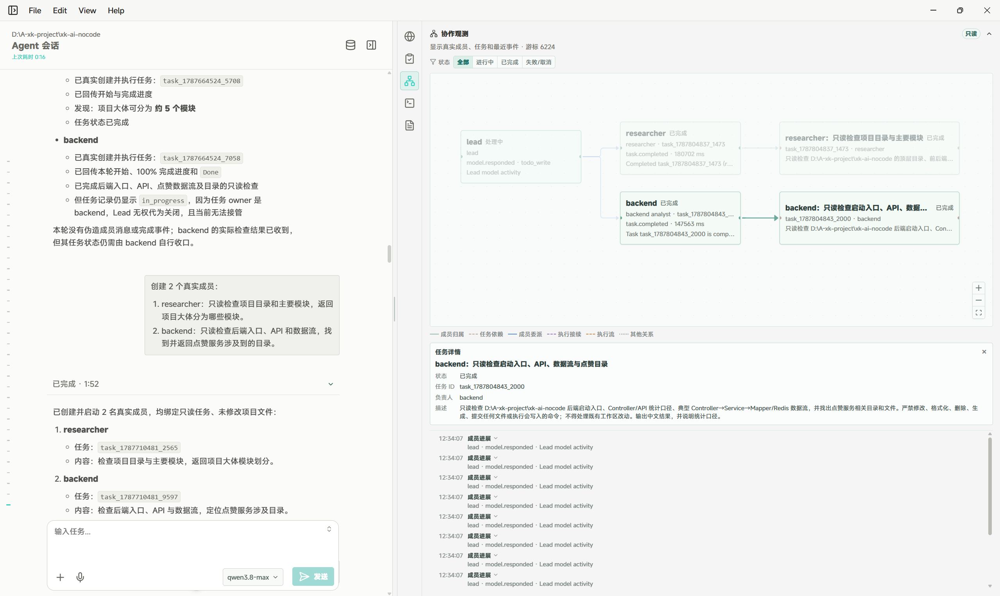
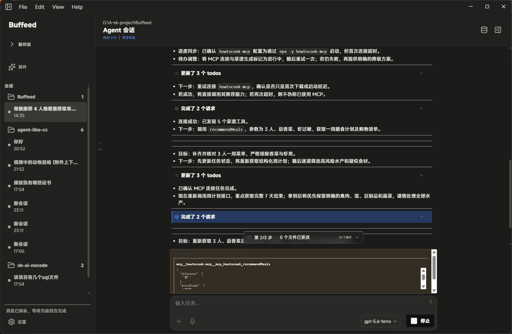
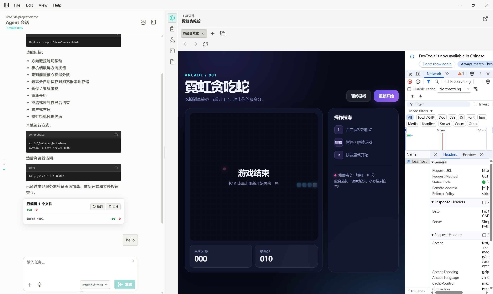

<div align="center">
  
  <h1>Buffeed</h1>
  <p><strong>把 AI Agent、项目上下文与知识库带回同一个本地工作台。</strong></p>
  <p>面向开发与知识工作的桌面应用，帮助你从一个目标出发，组织执行、观察过程，并获得可追溯的结果。</p>
  <p>
    <a href="https://github.com/kjkyes/Buffeed/releases/latest">下载 Windows 安装包</a>
    &nbsp;·&nbsp;
    <a href="https://github.com/kjkyes/Buffeed/blob/main/docs/%E7%B4%A2%E5%BC%95.md">查阅产品文档</a>
  </p>
</div>

## 在一个工作台完成复杂任务

Buffeed 将对话式 Agent、项目文件、工具执行和私有知识检索连接为连续的工作流。无需在多个窗口之间搬运上下文：描述目标、补充材料、查看执行过程，再审阅产物与变更。

```text
目标与上下文 -> Agent 执行 -> 人工确认 -> 结果、变更与知识溯源
```

## 产品亮点

### 让 AI 团队的协作过程看得见

复杂任务可以由多个 Agent 成员协同完成。Team 画布基于真实运行事件呈现成员、任务、依赖、执行阶段、工具调用和异常，让分工与进度不再是黑箱。

<div align="center">
  
</div>

> 每个成员、任务依赖与实时事件都有真实运行记录。

### 始终掌握执行控制权

在任务运行期间随时补充指令、排队后续工作或取消当前回合。涉及需要确认的操作时，Buffeed 提供人工审批；每个回合的执行轨迹与文件改动都可回看和审查。

<div align="center">
  
</div>

> 任务推进、工具调用与人工审批，都在同一条可回看的执行轨迹中。

### 让本地知识真正进入工作流

将资料导入知识库后，Buffeed 通过 RAG 将文档解析、混合检索与 Agent 任务连接起来。检索结果保留文档、页码和内容块等出处，便于核验结论来源。

### 经 RAGAS 验证的检索质量

在以 12 份中国法律文档构建的 60 条中文评测集上，Buffeed 的 RAG 覆盖基础问答、来源引用与知识库无答案时的拒答场景。四项 RAGAS 指标均基于完整的 60 条样本计算：

| 评估维度 | 得分 | 衡量内容 |
| --- | ---: | --- |
| 上下文精确度 | **0.832** | 检索内容与问题的关联程度 |
| 上下文召回率 | **0.772** | 检索内容对参考答案要点的覆盖程度 |
| 回答忠实度 | **0.856** | 回答是否得到检索上下文支持 |
| 回答相关性 | **0.739** | 回答与用户问题的匹配程度 |

评测集包含 35 条基础问答、15 条来源引用和 10 条无答案拒答样本。查看 [评测数据集](apps/rag/evals/cases.jsonl) 与 [完整评测报告](apps/rag/evals/report.json) 以复核指标口径和明细。
相关的法律文件可通过[国家法律法规数据库](https://flk.npc.gov.cn/search)的法律条目查找。

### 更快的响应与更流畅的流式体验

针对真实使用中的等待和阅读体验，Buffeed 优化了首响应链路、流式事件传输和首屏渲染。基于冷会话、热会话短回答、热会话长回答三类场景（各 10 次平均），首响应与绘制延迟显著降低，持续输出速度同步提升。

| 指标 | 冷会话 | 热会话（短回答） | 热会话（长回答） |
| --- | ---: | ---: | ---: |
| 模型 TTFT（ms） | 10079.30 → 4095.73<br>↓59.36% | 5164.39 → 1818.42<br>↓64.79% | 7187.11 → 2936.04<br>↓59.15% |
| 用户端首个流式到达（ms） | 10148.95 → 4163.69<br>↓58.97% | 5231.36 → 1893.28<br>↓63.81% | 7260.23 → 3012.72<br>↓58.50% |
| 首次绘制（ms） | 10287.50 → 4216.40<br>↓59.01% | 8426.20 → 1948.00<br>↓76.88% | 7579.70 → 3067.40<br>↓59.53% |
| SSE 到绘制耗时（ms） | 109.30 → 24.00<br>↓78.04% | 235.30 → 34.90<br>↓85.17% | 224.00 → 32.30<br>↓85.58% |
| 精确吐 token（token/s） | 32.31 → 40.55<br>↑25.50% | 63.78 → 681.74<br>↑968.89% | 46.49 → 62.43<br>↑34.29% |
| 字符吐出速度（字符/s） | 51.69 → 74.34<br>↑43.82% | 347.44 → 394.69<br>↑13.60% | 67.04 → 99.12<br>↑47.85% |

> 单元格格式为“基线 → 优化后”，↓ 表示耗时降低，↑ 表示吞吐提升。基线与优化后均为三种场景各 10 次的平均值；吞吐指标仅在单次模型响应且 usage 完整时统计。短回答的精确吐 token 提升受基线值较低影响。

### 以多模态上下文开始工作

文件、文件夹、剪贴板图片、音频、视频和既有会话都可以成为任务上下文。工作台内置 Markdown、Mermaid、PDF、Word、演示文稿、表格、图片和视频预览，让材料与结果在同一处流转。

### 为项目工作而设计的桌面体验

持久化会话将不同任务保持清晰分隔；内置终端、浏览器、文件预览与代码审查工具让你无需离开当前工作区。浅色、深色、字体、字号与布局均可按个人习惯调整。

<div align="center">
  
</div>

> 对话、预览、浏览与审查，无需离开工作区。

## 适合这些场景

| 你要做的事 | Buffeed 如何协助 |
| --- | --- |
| 理解一个陌生项目 | 让 Agent 研究代码与文档，并在画布中查看任务拆分和依据。 |
| 实现或审查改动 | 结合工作区上下文执行任务，审查每回合的操作轨迹与文件变化。 |
| 基于内部资料回答问题 | 导入文档并进行可溯源检索，将证据带回对话与任务结果。 |
| 处理跨材料的复杂问题 | 将文本、文档、表格与多媒体资料作为同一任务的上下文。 |

## 快速开始

### 首次配置

安装后请使用自己的配置，维护自身的 `.buffeed`、`.env`、密钥或 RAG 数据。

建议设置：

```powershell
$env:BUFFEED_HOME="D:\buffeed_data\.buffeed"
```

也可以不设置，Windows 默认使用：

```text
%USERPROFILE%\.buffeed
```

然后在 `BUFFEED_HOME` 目录下创建 `.env`，按需配置：

- `MODEL_ID`、`ANTHROPIC_API_KEY`：主 Agent 模型
- `FALLBACK_MODEL_ID`：备用模型
- `DASHSCOPE_API_KEY`：DashScope 文本/视频模型
- `BUFFEED_DASHSCOPE_MAX_CONNECTIONS`、`BUFFEED_DASHSCOPE_MAX_KEEPALIVE`：DashScope 连接池上限
- `BUFFEED_ANTHROPIC_MAX_IN_FLIGHT`、`BUFFEED_DASHSCOPE_MAX_IN_FLIGHT`：Provider 模型请求并发上限
- `BUFFEED_TEAM_MAX_MEMBERS`：运行时 Team 成员上限
- `BUFFEED_MODEL_SLOT_WAIT_SECONDS`：模型并发槽位最长排队时间
- `COS_SECRET_ID`、`COS_SECRET_KEY`、`COS_REGION`、`COS_BUCKET`：视频上传 COS
- `MCP_CONFIG_PATH`：自定义 MCP 配置
- `DESKTOP_PYTHON`：指定 Python 解释器
- `DESKTOP_FFMPEG`：指定 FFmpeg
- `WHISPER_CPP_BIN`、`WHISPER_CPP_MODEL_PATH`：启用本地语音识别时配置
- `RAG_*`：启用 RAG 服务时配置

开发版还会读取项目根目录的 `.env`；安装版应优先使用用户自己的 `BUFFEED_HOME\.env`。

### 工作区数据

创建会话时请选择实际项目工作区。附件会复制到：

```text
<工作区>\.desktop-attachments\
```

该目录保存粘贴的图片、视频和选择的文件副本，目前不会自动清理。

确认不再需要历史附件后，可以手动删除其中的文件。删除后，旧消息可能无法重新生成附件预览，也无法让 Agent 再次读取这些附件；不会影响原始文件。

### 自动清理的缓存

以下缓存会自动清理：

- Electron 视频预览缓存：应用启动时清理，默认超过 14 天或总大小超过 1 GB
- Agent 视频分析缓存：处理新视频前清理，默认超过 30 天或总大小超过 1 GB

安啦~ 这些清理不会删除工作区中的原始文件或 `.desktop-attachments`。

### 注意事项

- 不要删除 `BUFFEED_HOME\state`，其中包含会话、运行状态等数据
- 二次开发时不要将 `.env`、API 密钥、COS 密钥、RAG 输入数据、知识库和本地附件提交到远程仓库
- 安装目录不建议作为项目工作区，推荐使用独立的用户项目目录


### 启动桌面工作台

```powershell
cd apps/desktop
npm run dev
```

### 启用本地知识库

```powershell
./deploy/compose.ps1 up -d
```

启动后，创建一个会话，选择工作区，输入目标并按需附加材料即可开始。

## 构建 Windows 应用

```powershell
cd apps/desktop
npm run package:win
```

---

<div align="center">本地优先，过程可见，结果有据可查。</div>
