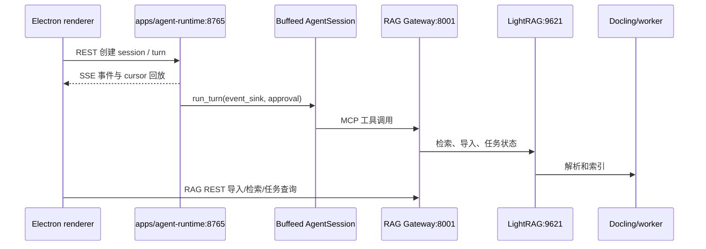

# 运行时地图

## 调用链

## 运行时事实

| 组件 | 默认地址 | 事实来源 | 职责 |
| --- | --- | --- | --- |
| Agent API | `127.0.0.1:8765` | `apps/agent-runtime/desktop_api.py` + `Buffeed_core.py` | session、turn、审批、SQLite journal、SSE、Team 快照 |
| RAG Gateway | `127.0.0.1:8001` | `apps/rag/rag_api.py`、`apps/rag/gateway.py` | REST facade + MCP transport |
| LightRAG API | 容器内 `9621` | `apps/rag/lightrag_profile_server.py`，由 `data/rag/compose.yaml` 编排 | 检索和索引 API |
| Docling | `127.0.0.1:5001` | `data/rag/compose.yaml`（源码构建上下文为 `apps/rag`） | 文档解析 |
| Electron | 本地窗口 | `apps/desktop` | 生命周期、UI、文件选择 |

## 边界规则

- renderer 只调用 Agent REST/SSE 和 RAG REST。
- Agent 使用 MCP Gateway 访问 RAG 工具。
- RAG worker 负责持久化索引任务；Buffeed 只提交和读取状态。
- `search_ready` 与 `graph_ready` 是不同的后端状态，不能用一个“已就绪”覆盖两者。
- `/api/v1/sessions/{session_id}/team` 优先读取 durable `run.*` journal，缺少 plan 时才兼容读取 Buffeed 的任务文件和 `active_teammates`；`/team/events` 只读回放，不开放协作写操作。
